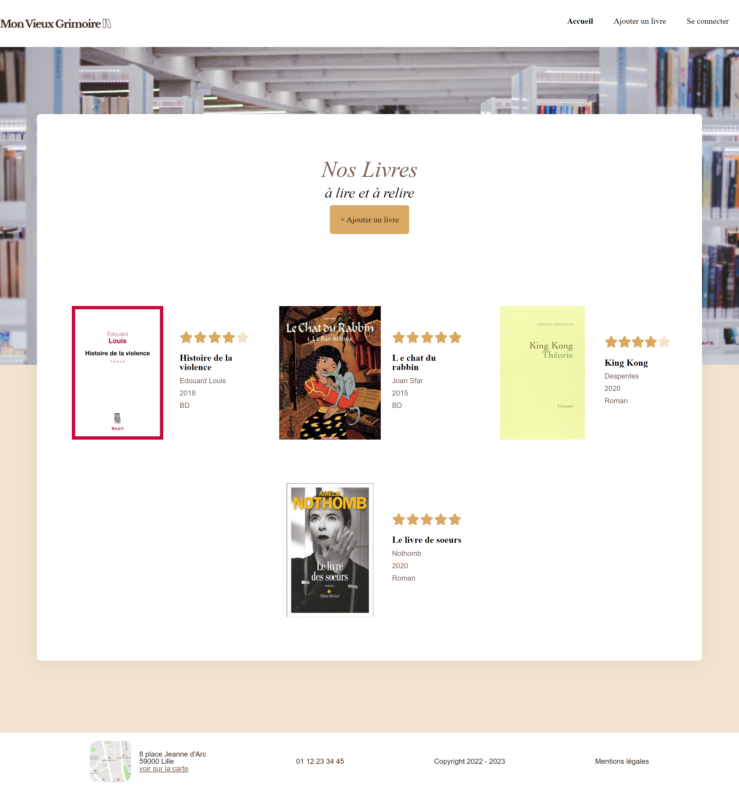

# Mon vieux Grimoire - Development of the back-end of a book rating website.

## Table of contents

- [Overview](#overview)
  - [The mission](#the-mission)
  - [Screenshot](#screenshot)
  - [Links](#links)
- [My process](#my-process)
  - [Built with](#built-with)
  - [What I learned](#what-i-learned)
  - [Useful resources](#useful-resources)
- [Projet Launch](#projet-launch)
- [Author](#author)

## Overview

Project Mission during my training at OpenClassrooms in 2023.

### The mission

As a back-end developer within a book rating project, my main responsibility is to establish the API. To achieve this, I have designed and implemented a logical data model in compliance with current standards and regulations. I have ensured secure data storage management by implementing robust security mechanisms to guarantee the confidentiality and integrity of information. Additionally, I have securely implemented CRUD operations, using recommended development practices to prevent vulnerabilities and security risks.

### Screenshot



### Links

- Solution URL: [Code on Github](https://github.com/MarieCourse/mon-view-grimoire)

## My process

### Built with

- MongoDB
- Express
- React
- Node.js

### What I learned

This experience has allowed me to acquire essential skills in backend development and ensure the reliability and security of the API for the book rating project. I learned how to secure a database through password hashing and authentication on all required routes. I implemented middlewares, particularly for user authentication and image formatting before being saved in the database.

I gained knowledge in setting up the four essential operations for creating and managing persistent data elements (Create, Read, Update, and Delete) in the database.

## Projet Launch

Clone the repo

```
git clone https://github.com/MarieCourse/mon-view-grimoire
```

If you want to display the code for the backend and frontend, do it in two separate instances of VSCode to avoid any issues.

### Frontend

1. Navigate to the `frontend` directory.
2. Use npm to install dependencies by executing the command:
   ```
   npm install
   ```
3. To start the project, use the command:
   ```
   npm start
   ```

The project's frontend will be launched, allowing you to explore the magical world of the grimoire.

### Backend

1. Navigate to the `backend` directory.
2. Install the required dependency using the command:
   ```
   npm install dotenv
   ```
3. To start the server, execute the command:
   ```
   node server
   ```

The project's backend will be launched, ready to serve and respond to requests.

## Author

Maria Carrera

[](https://mariecourse.github.io/portfolio/)

[](https://www.linkedin.com/in/maria-carrera-france/)
